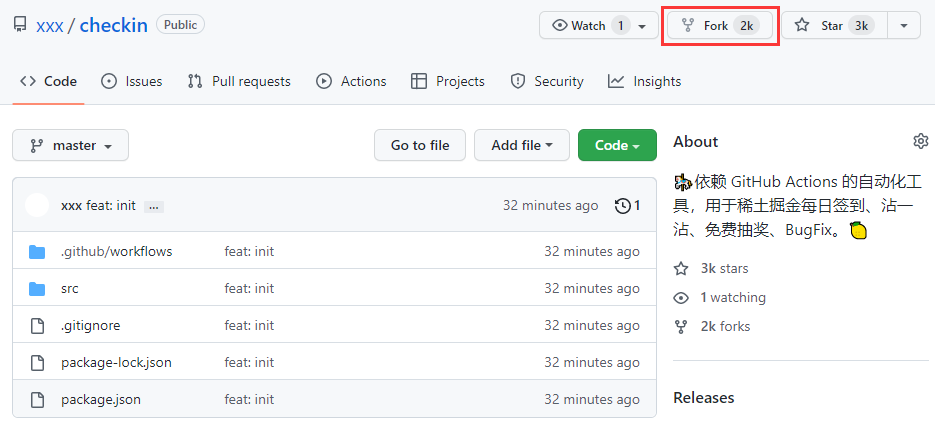
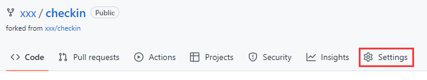
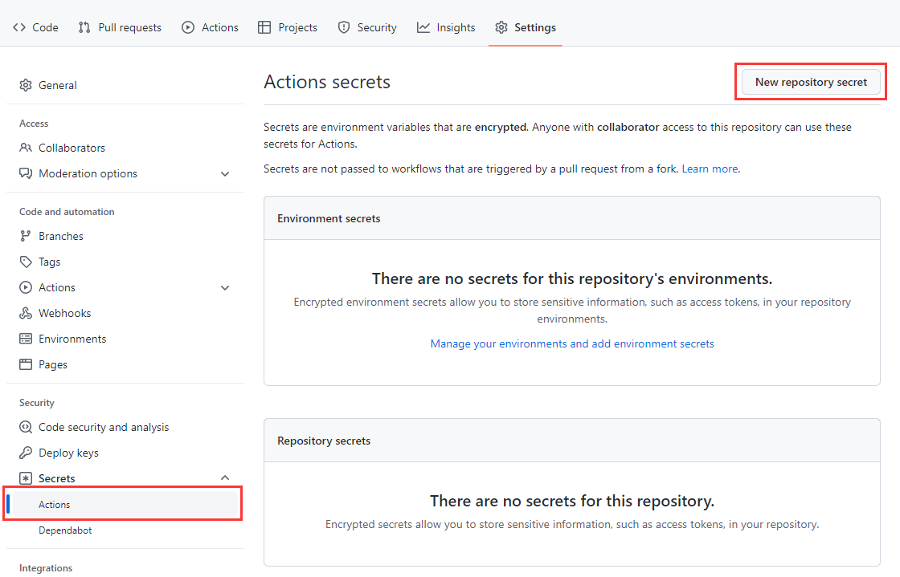
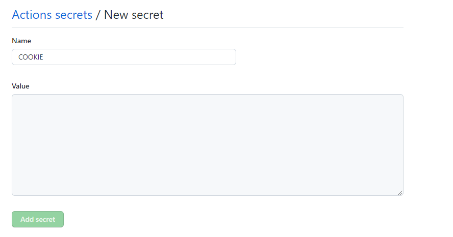

# Check in

  

  

  

## 指南

&emsp;&emsp;依赖 [GitHub Actions](https://docs.github.com/cn/actions/learn-github-actions/understanding-github-actions) 的自动化工具，用于稀土掘金每日签到、沾一沾、免费抽奖、`BugFix`。

* [工具介绍](https://juejin.cn/post/7106509657098682404)

## 如何使用

### Fork 仓库

&emsp;&emsp;`Fork`当前仓库。

&emsp;&emsp;点击`Fork`仓库的`Settings`菜单。

&emsp;&emsp;找到左侧菜单`Secrets`的子菜单`Actions`，点击`New repository secret`按钮，添加环境变量。

&emsp;&emsp;`Name`固定为`COOKIE`。

### Cookie

## 第三方插件

* [axios](https://github.com/axios/axios)
* [nodemon](https://github.com/remy/nodemon)
* [moment-timezone](https://github.com/moment/moment-timezone)